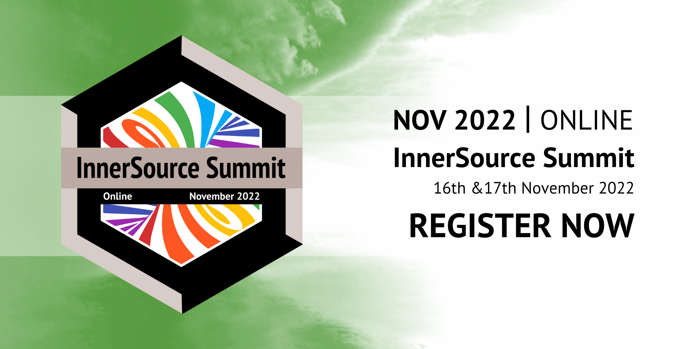


Maximilian Capraro


We are happy to be part of the lineup for the InnerSource Commons Summit 2022 (16th & 17th November 2022, online). The conference is the world's leading gathering of InnerSource practitioners.

Together with Oliver Treidler of <a href="http://www.tp-and-c.com/" target="_blank">TP&C</a>, we will be giving the talk _Transfer Pricing for InnerSource - Done Right_ and invite you to join us!

In detail, our talk will deliver:
- Introduction to transfer pricing & the arm's length principle
- Transfer Pricing in the context of InnerSource: Why & when is it needed?
- A case study & five steps to establish transfer pricing in your InnerSource program
- Room for your questions

Please find a detailed agenda of the event and get your ticket directly at the <a href="https://innersourcecommons.org/events/isc-2022/" target="_blank">events page for the InnerSource Commons Summit 2022</a>.

We are looking forward to seeing you there!
